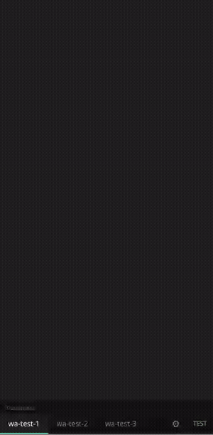
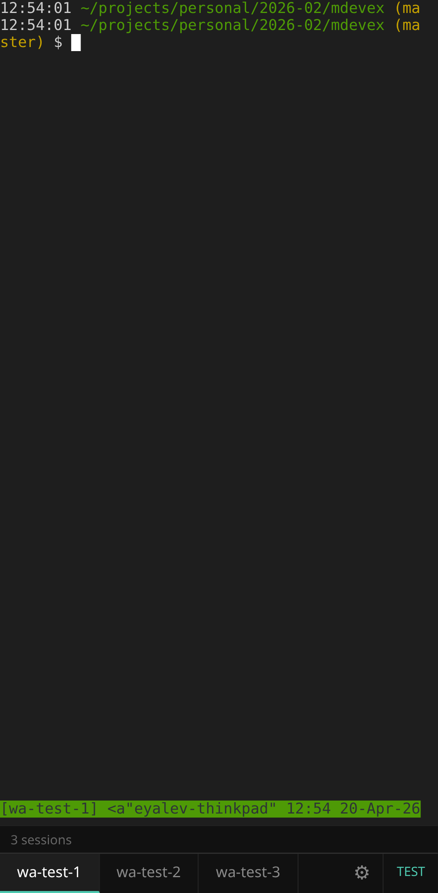
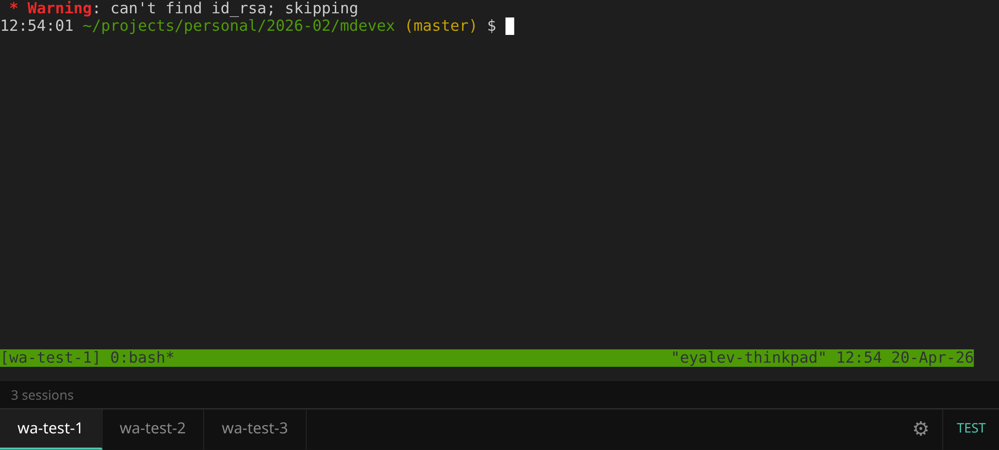

# mdevex

A minimal web-based tmux client with a plugin-first architecture.

Open your tmux sessions in a browser tab. Every feature — tabs, terminal rendering, status bar, settings, touch scrolling — is a plugin, so you can swap pieces out or add your own without forking.



<p align="center">
  
  &nbsp;
  
</p>

## Install

### Global (recommended)

```bash
npm install -g mdevex
mdevex
```

### From source

```bash
git clone https://github.com/eyalev/mdevex.git
cd mdevex
npm install
npm start
```

Then open **http://localhost:7682** in your browser. Your existing tmux sessions appear as tabs.

## Requirements

- Node.js 18+
- `tmux` on `PATH`
- Build tools for [`node-pty`](https://github.com/microsoft/node-pty):
  - Debian/Ubuntu: `sudo apt install build-essential python3`
  - macOS: `xcode-select --install`

## Configuration

| Env var | Default | Description |
| --- | --- | --- |
| `PORT` | `7682` | HTTP/WebSocket port |
| `MDEVEX_EXTRA_PLUGIN_DIR` | — | Extra directory to scan for plugins |

Per-user settings are persisted to `~/.config/mdevex/settings.json`.

## Plugins

Plugin directories are scanned in this order — later entries override earlier ones by `id`:

1. `<install-dir>/core-plugins/` — the seven bundled plugins
2. `<install-dir>/plugins/` — project-bundled user plugins
3. `~/.mdevex/plugins/` — your personal plugins
4. `$MDEVEX_EXTRA_PLUGIN_DIR` — optional extra path

A plugin is a directory with a `plugin.json` manifest and up to two code files:

```
my-plugin/
  plugin.json     ← required
  server.js       ← optional, ES module, default export is the plugin fn
  client.js       ← optional, IIFE that receives window.mdevex
```

### Minimal example

```json
// plugin.json
{ "id": "hello", "name": "Hello", "description": "Says hi" }
```

```js
// client.js
(function (api) {
  const el = document.createElement('span');
  el.textContent = '👋';
  api.slots['toolbar-right'].appendChild(el);

  api.on('session-changed', ({ session }) => {
    console.log('switched to', session);
  });
})(window.mdevex);
```

```js
// server.js
export default function ({ app, wss, eventBus, pluginDir, manifest }) {
  app.get('/api/hello', (_req, res) => res.json({ ok: true }));

  eventBus.on('ws-connect', ({ session }) => {
    console.log('ws opened for', session);
  });
}
```

Full plugin API (events, UI slots, client methods): see [plugins/README.md](plugins/README.md).

### Bundled core plugins

| Plugin | Purpose |
| --- | --- |
| `tmux-backend` | WebSocket ↔ PTY ↔ tmux bridge |
| `xterm` | xterm.js terminal renderer |
| `tab-bar` | Session list and tab switching |
| `status-bar` | Bottom status line |
| `settings-panel` | Overlay for user settings |
| `font-size` | `+` / `−` controls |
| `touch-scroll` | Mobile touch scrolling |

Read them in [`core-plugins/`](core-plugins/) as reference implementations.

## Development

```bash
npm install
npm start                # runs on PORT=7682
npm test                 # Playwright: starts a throwaway server on 7683
```

The test suite spins up isolated tmux sessions (`wa-test-*`), boots the server, and asserts the core flows (tab switching, terminal data, resize, auto-reconnect, plugin loading). Tear-down kills the sessions.

## License

[MIT](LICENSE)
